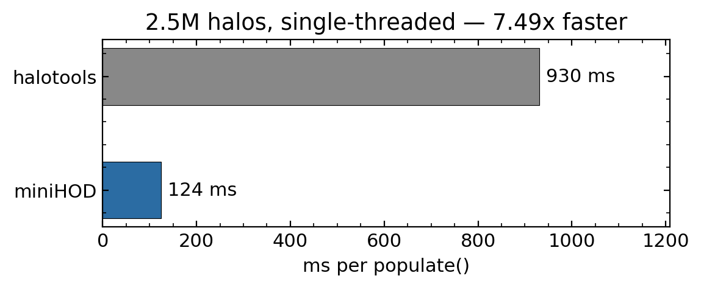

# miniHOD

A minimal HOD code, written in C, called from Python.
About 7-8× faster than halotools on a single thread; scales further with OpenMP.



## Install

```bash
pip install -e .            # compiles the C backend (needs gcc + OpenMP)
```

Needs `numpy` and `scipy`. The validation notebook also uses `halotools` and `Corrfunc`.

**Heads up:** Don't run scripts that `import miniHOD` from the folder *above* the cloned repo — Python will find the repo directory instead of the installed package and imports will break.

## Usage

```python
from miniHOD import HOD

model = HOD(halo_masses, halo_pos, halo_vel, halo_r200m, box_size=1000.0)

galaxies = model.populate(logMmin=12.5, sigma_logM=0.5, fmax=1.0,
                          logMsat=13.5, logMcut=11.5, alpha=1.0, seed=42)

pos        = galaxies['pos']         # (Ngal, 3) Mpc/h
vel        = galaxies['vel']         # (Ngal, 3) km/s
is_central = galaxies['is_central']  # (Ngal,) bool
halo_idx   = galaxies['halo_idx']   # (Ngal,) int — index into input arrays

host_mass = halo_masses[halo_idx]    # no cross-matching needed
```

Create the `HOD` object once, then call `populate()` in your MCMC loop.
Buffers are pre-allocated — no heap allocation in the hot path.

You can also fix `logMmin` to hit a target number density (bisection, no RNG):

```python
galaxies = model.populate(n_target=5e-4, sigma_logM=0.5, fmax=1.0,
                          logMsat=13.5, logMcut=11.5, alpha=1.0, seed=42)
```

Or check the mean density without populating at all — useful as a cheap prior:

```python
n = model.mean_number_density(logMmin=12.5, sigma_logM=0.5, fmax=1.0,
                              logMsat=13.5, logMcut=11.5, alpha=1.0)
```

## Model

Standard Zheng+07 plus $f_\mathrm{max}$, which caps the central occupation below 1.
This is the single most useful extension for samples that don't saturate
(ELGs, color-selected, basically anything from DESI). The average number of galaxies per halo is given by

$$\langle N_\mathrm{cen}\rangle = \frac{f_\mathrm{max}}{2}\left[1 + \mathrm{erf}\\left(\frac{\log_{10} M - \log_{10} M_\mathrm{min}}{\sigma_{\log M}}\right)\right]$$

$$\langle N_\mathrm{sat}\rangle = \left(\frac{M}{M_\mathrm{sat}}\right)^\alpha \exp\\left(-\frac{M_\mathrm{cut}}{M}\right)$$

Satellites are Poisson-drawn only in halos that already host a central.

Six parameters: `logMmin`, `sigma_logM`, `fmax`, `logMsat`, `logMcut`, `alpha`.
All masses are **M200m** (the AbacusSummit / DESI convention).

**Satellite positions** follow an NFW profile (rejection sampling).
Default concentration is Duffy+08 (M200m, z=0, WMAP5);
pass your own `halo_conc` array if you have better estimates.
**Satellite velocities** use the radially-dependent Jeans dispersion
for an NFW potential (Łokas & Mamon 2001), tabulated once as a 128-point lookup.

## Validation

Tested against halotools Zheng07 — occupation functions, $w_p(r_p)$,
velocity distributions, NFW profile KS tests.
See all validation plots in [`miniHOD_demo.ipynb`](miniHOD_demo.ipynb).

## Layout

```
src/hod.c          C core (populate, NFW sampler, mean density)
miniHOD/hod.py     Python API, buffer management, bisection
miniHOD/_core.py   ctypes bindings
tests/             pytest suite
```

## Testing

```bash
pip install .[test]
python -m pytest tests/ -v
```
